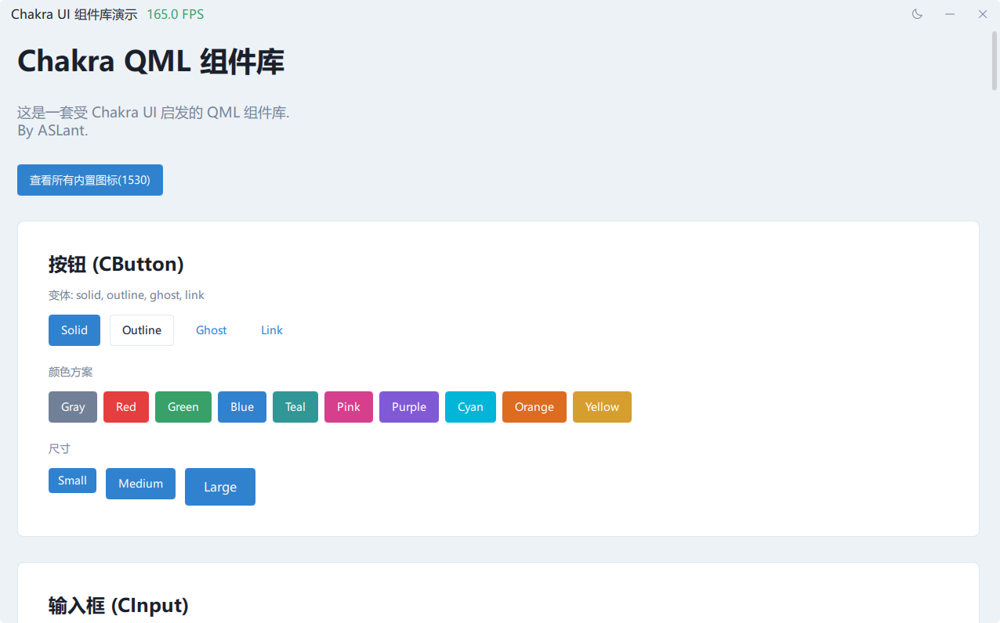
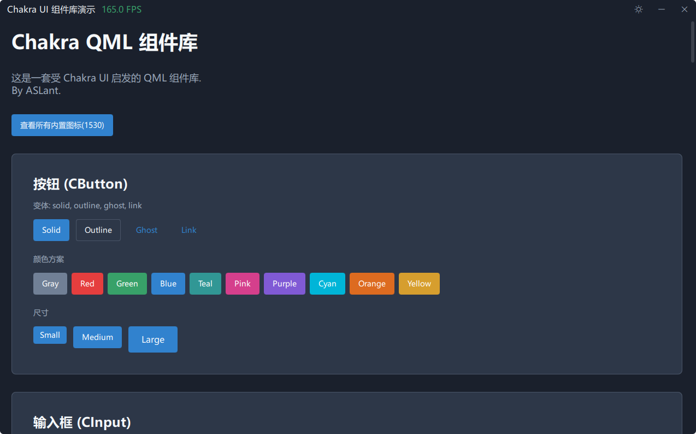
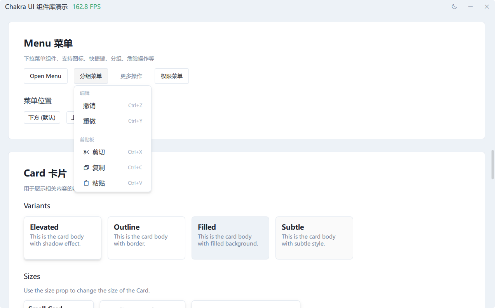

# Chakra UI QML

受 [Chakra UI](https://chakra-ui.com/) 启发的现代化、易用的 QML 组件库。

[English](README.md) | 简体中文

## 预览

### 按钮组件


### 输入框组件


### 卡片组件


### 深色模式


## 特性

- **35+ 个组件** - 按钮、输入框、卡片、菜单、对话框等
- **深色模式** - 内置主题系统，支持亮色/暗色模式
- **高性能** - 优化的渲染，最小化开销
- **无边框窗口** - 原生 Windows DWM 阴影和自定义标题栏
- **类型安全** - 完整的 PySide6 集成和类型提示
- **响应式** - 自适应布局和尺寸系统
- **可访问性** - 符合 ARIA 规范的组件（适用时）

## 安装

```bash
pip install chakra-qml
```

## 快速开始

在 QML 文件中导入 Chakra 并使用组件：

```qml
import Chakra

CWindow {
    CButton { text: "点击我" }
}
```

更多完整示例见 `examples/` 文件夹。

## 可用组件

### 布局
- `CBox` - 灵活的容器，支持样式属性
- `CFlex` - Flexbox 布局容器
- `CFlow` - 流式布局，自动换行
- `CCenter` - 居中对齐容器
- `CContainer` - 响应式容器，带最大宽度
- `CSpacer` - 弹性间隔组件

### 表单
- `CButton` - 多功能按钮，支持多种变体和尺寸
- `CInput` - 文本输入框，支持验证状态
- `CCheckbox` - 复选框，支持不确定状态
- `CSwitch` - 开关切换，带标签
- `CSelect` - 下拉选择框，支持搜索

### 数据展示
- `CCard` - 内容卡片，带页眉/页脚
- `CBadge` - 小型状态指示器
- `CTag` - 可移除的标签组件
- `CProgress` - 进度条，支持多种变体
- `CSpinner` - 加载动画
- `CIcon` - 图标组件，1000+ Phosphor 图标

### 反馈
- `CAlert` - 警告消息，支持状态
- `CTooltip` - 悬停提示
- `CHoverCard` - 悬停卡片，支持富内容

### 覆盖层
- `CDialog` - 模态对话框
- `CDrawer` - 侧边抽屉/面板
- `CMenu` - 下拉菜单
- `CMenuGroup` - 菜单分组容器
- `CMenuItem` - 菜单项组件
- `CMenuSeparator` - 菜单分隔线

### 导航
- `CPagination` - 分页控件
- `CSegmentedControl` - 分段选择器

### 滚动
- `CScrollBar` - 自定义滚动条
- `CScrollArea` - 可滚动区域
- `CListView` - 优化的列表视图
- `CGridView` - 优化的网格视图

### 其他
- `CWindow` - 无边框窗口，带原生阴影
- `CActionBar` - 浮动操作栏

## 主题自定义

库使用集中式的 `AppStyle` 单例进行主题管理。使用 `AppStyle.toggleTheme()` 切换亮色/深色模式。

## 无边框窗口

使用 `CWindow` 组件创建带原生 Windows 阴影的现代无边框窗口。

## 性能优化

本库针对性能进行了优化：

- 避免不必要的 `layer.effect` 使用
- 高效的属性绑定
- `AppStyle` 中缓存的颜色映射
- 无边框窗口使用原生 Windows API
- 最小化动画开销

## 系统要求

- Python >= 3.8
- PySide6 >= 6.5.0+

## 开源协议

MIT License - 详见 [LICENSE](LICENSE) 文件

## 致谢

灵感来自 Segun Adebayo 的 [Chakra UI](https://chakra-ui.com/)。
